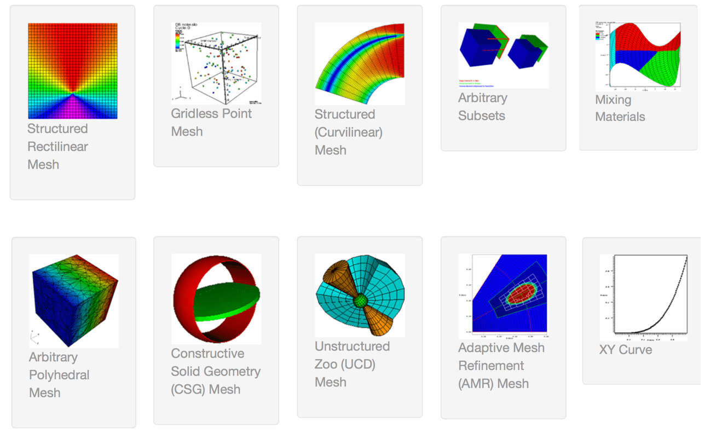

Main
----

The design of MACSio_ is described in more detail in
:download:`an accompanying design document <macsio_design.pdf>`. Here, we provide only a high
level overview.

MACSio_ is divided into two halves; the MACSio main *driver* and the I/O *plugin(s)*.

The main driver generates the scientific data objects (examples of which are pictured below)
typical of HPC, multi-physcis simulation codes. It also orchestrates a number of activities such as
compute and/or communication workloads to be mixed with the I/O workload, time and space
performance data gathering, event logging and other support operations.

   Scientific computing data objects typical of mesh-based multi-physics simulation codes

The other half of MACSio_ is the I/O *plugin(s)*.
A MACSio_ *plugin* orchestrates marshalling of data between memory and disk. Different plugins
exist to implement different I/O *proxies*. For example, the Silo plugin serves as a proxy for
many (not all)
`LLNL simulation codes <https://wci.llnl.gov/simulation/computer-codes>`_. The Exodus plugin
serves as proxy for many
`Sandia simulation codes <https://www.sandia.gov/asc/integrated_codes.html>`_.
On the other hand, instead of representing a proxy for any specific organization or code, the
HDF5 plugin serves as a proxy for the *best* way to use HDF5 for various
*parallel I/O paradigms*. It also provides a number of command-line options to control low-level
features of the HDF5 library to help probe the impact of various options on the performance space.

.. note:: Should extend MACSio_ to support scripted sequences of dumps

MACSio_'s main driver accepts a slew of command-line arguments. If MACSio_ has been built, you can
obtain help for MACSio_'s main driver arguments

MACSio_'s command-line arguments are designed to give the user control over the nominal I/O request sizes
emitted from MPI ranks for mesh bulk data and for amorphous metadata. The user specifies a size, in bytes,
for mesh pieces. MACSio_ then computes a mesh part size, in nodes, necessary to hit this target byte count for
double precision data. MACSio_ will determine an N dimensional logical size of a mesh piece that is a close
to equal dimensional as possible. In addition, the user specifies an average number of mesh pieces that will be
assigned to each MPI rank. This does not have to be a whole number. When it is a whole number, each MPI rank
has the same number of mesh pieces. When it is not, some processors have one more mesh piece than others.
This is common of HPC multi-physics applications. Together, the total processor count and average number of
mesh pieces per processor gives a total number of mesh pieces that comprise the entire mesh. MACSio_ then
finds an N dimensional arrangement (N=[1,2,3]) of the pieces that is as close to equal dimension as possible.
If mesh piece size or total count of pieces wind up being prime numbers, MACSio_ will only be able to factor
these into long, narrow shapes where 2 (or 3) of the dimensions are of size 1. That will make examination of
the resulting data using visualization tools like VisIt a little less convenient but is otherwise harmless
from the perspective of driving and assessing I/O performance.
