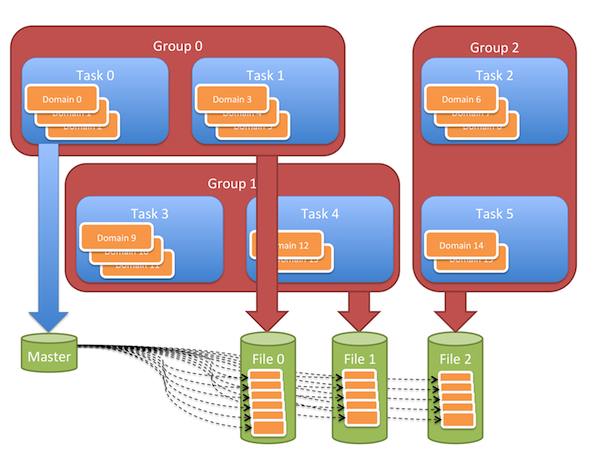
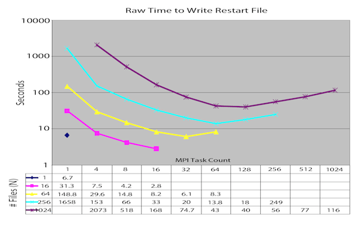

Parallel I/O Paradigms
----------------------

MACSio_ provides utility packages to support the development of plugins handling
a variety of parallel I/O paradigms and variations thereof. These include

* Multiple Independent File (MIF_) parallel I/O
  * With and without `SCR`_
  * With and without *naive* Two-Phase
* Single, Shared File (SSF) parallel I/O
* Hybrid MIF_/SSF where each MIF_ file is handled via SSF
* Multi-Pass
* Application managed/extra I/O nodes.

To be clear, MACSio_ itself does NOT implement any of these parallel I/O paradigms.
Rather, MACSio_ provides some utility packages that enable plugin developers to 
implement various parallel I/O paradigms. These packages are described here.

Multiple Independent File (MIF) Parallel I/O
^^^^^^^^^^^^^^^^^^^^^^^^^^^^^^^^^^^^^^^^^^^^

MACSio_'s Multiple Independent File (MIF_) package is designed to support the development
of plugins utilizing the MIF_ paradigm.

In the multiple, independent file paradigm, parallelism is achieved through
simultaneous access to multiple files. The application divides itself into file groups.
For each file group, the application manages exclusive access among all the tasks of
the group. I/O is serial within groups but parallel across groups. The number of files
(groups) is wholly independent from the number of processors or mesh-parts. It is often
chosen to match the number of independent I/O pathways available in the hardware between
the compute nodes and the filesystem. The MIF_ paradigm is sometimes also called N->M
because it is N tasks writing to M files (M<N).

In this paradigm I/O requests are almost exclusively independent. However, there are
scenarios where collective I/O requests can be made to work and might even make sense
in the MIF_ paradigm.  MIF_ is often referred to as Poor Man’s parallel I/O because the
onus is on the application to manage the distribution of data across potentially many
files. In truth, this illuminates the only salient distinction between Single Shared
File (SSF) and MIF_. In either paradigm, if you dig deep enough into the I/O stack, you
soon discover that data is always being distributed across multiple files. The only
difference is where in the stack the distribution into files is handled. In the MIF_
paradigm, it is handled explicitly by the application itself. In a typical SSF paradigm,
it is handled by the underling filesystem.

In MIF_, MPI tasks are divided into N groups and each group is responsible for creating
one of the N files. At any one moment, only one MPI task from each group has exclusive
access to the file. Hence, I/O is serial within a group. However, because one task in
each group is writing to its group's own file, simultaneously, I/O is parallel across
groups.

    In the example in the diagram, the computational object is decomposed into 16 pieces,
    called domains, distributed among 6 tasks. Some tasks have 3 domains and some have 2.
    Tasks are formed into 3 groups each group producing one file. Finally, a small “master”
    file is written to capture information on how all the pieces are distributed among the files.

A call to :any:`MACSIO_MIF_Init` establishes the mapping of tasks to file groups.

Within a group, access to the group's file is handled in a round-robin fashion. The first
MPI task in the group creates the file and then iterates over all mesh pieces it has.
For each mesh piece, it creates a sub-directory within the file (e.g., a separate namespace for 
the objects). It repeats this process for each mesh piece it has. Then, the first
MPI task closes the file and hands off exclusive access to the next task in the group.
That MPI task opens the file and iterates over all domains in the same way. Exclusive
access to the file is then handed off to the next task. This process continues until
all processors in the group have written their domains to unique sub-directories in the file.

Calls to :any:`MACSIO_MIF_WaitForBaton` and :any:`MACSIO_MIF_HandOffBaton` handle this handshaking
of file creations and/or opens and bracket blocks of code that are performing MIF_ I/O.

After all groups have finished with their files, an optional final step may involve creating
a master file which contains special metadata objects that point at all the pieces of
mesh (domains) scattered about in the N files.

A call to :any:`MACSIO_MIF_Finish` frees up resources associated with handling MIF_ mappings.

The basic coding structure for a MIF_ I/O operation is as follows...

.. code-block:: c

    MACSIO_MIF_baton_t bat = MACSIO_MIF_Init(. . .);
    SomeFileType *fhndl = (SomeFileType *) MACSIO_MIF_WaitForBaton(bat, "GroupName", "ProcName");

        /* this task's work on the file */

    MACSIO_MIF_HandOffBaton(bat, fhndl);
    MACSIO_MIF_Finalize(bat);

Setting N to be equal to the number of MPI tasks, results in a file-per-process configuration,
which is typically not recommended. However, some applications do indeed choose to run this
way with good results. Alternatively, setting N equal to 1 results in effectively serializing
the I/O and is also certainly not recommended. For large, parallel runs, there is typicall a
sweet spot in the selection of N which results in peak I/O performance rates. If N is too large,
the I/O subsystem will likely be overwhelmed; setting it too small will likely underutilize
the system resources. This is illustrated
of files and MPI task counts.

    Time to write a restart file from Ale3d as a function of MPI Task count and MIF file
    count (circa 1999)

This approach to scalable, parallel I/O was originally developed in the late 1990s by Rob Neely,
a lead software architect on ALE3D at the time. It and variations thereof have since been adopted
by many codes and used productively through several transitions in orders of magnitude of MPI task
counts from hundreds then to hundreds of thousands today.

There are a large number of advantages to MIF-IO over SSF-IO.

* MIF_ enables the use of serial (e.g. non-parallel) I/O libraries. One caveat is that such
  libraries do need to provide namespace features (e.g. sub-directories).
* MIF_ is a much simpler programming model because it frees developers from having to think
  in terms of collective I/O operations. The code to write data from one MPI task doesn't depend
  on or involve other tasks. For large multi-physics applications where the size, shape and even
  existence of data can vary dramatically among MPI tasks, this is invaluable in simplifying
  I/O code development.
* MIF_ alleviates any need for global-to-local and local-to-global remapping upon every
  exchange of data between the application and its file.
* Some Data-in-transit (DIT) services (e.g. those that may change size or shape such as
  compression) are easier to apply in a MIF_ setting because processors are freed from
  having to coordinate with each other on changes in data size/shape as it is moved to the file.
* Good performance demands very little in the way of extra/advanced features from the underlying
  I/O hardware and filesystem. A relatively dumb filesysem can get it right and perform well.
* Application controlled throttling of I/O is easily supported in a MIF_ setting because the
  number of concurrent operations is explicitly controlled. This can help to avoid overloading the
  underlying I/O subsystems.
* MIF_ is consistent with the way leading-edge commercial *big data* I/O in
  map-reduce operations is handled. Data sets are broken into pieces and stored in the
  filesystem as a collection of shards and different numbers of parallel tasks can process
  different numbers of shards.

MACSio_'s MIF_ Package and Naive Two-Phase I/O
""""""""""""""""""""""""""""""""""""""""""""""

.. warning:: FEATURE CURRENTLY IN DESIGN

   An additional option available in MACSio_'s MIF_ package is support for a *naive* form of
   two-phase I/O. In this mode, I/O requests from each parallel task are accumulated into
   a local ram-disk or other form of node-local storage. This process proceeds in an
   embarrasingly parallel way until either a threshold of storage is reached or the plugin
   explicitly indicates a flush is desired. At this point, all parallel tasks block while
   local data accumulated on each task is aggregted to aggregator tasks where the actual
   I/O is performed. To accomplish this, MACSio_ implements what amount to a *virtual file*
   such that all I/O operations performed by a task are captured in this *vitual file*.
   Aggregation is performed by message passing these virtual files to aggregator tasks
   which essentially turn around and replay.

MACSio_'s MIF_ Package and `SCR`_
"""""""""""""""""""""""""""""""""
These MIF_ utilities are designed to support use in conjunction with the 
Scalable Checkpoint / Restart (`SCR`_) library.
However, use of `SCR`_ may place additional restrictions on the tasks-to-files
mapping depending, partially, on whether `SCR`_ is configured to write to
node-local storage. For example, `SCR`_ is typically supported only in
file-per-processor mappings.

MIF_ API
^^^^^^^^

.. doxygenstruct:: _MACSIO_MIF_ioFlags_t

.. doxygengroup:: MACSIO_MIF

.. only:: internals

    .. doxygenstruct:: _MACSIO_MIF_baton_t

Single Shared File (SSF) Parallel I/O
^^^^^^^^^^^^^^^^^^^^^^^^^^^^^^^^^^^^^

.. _SCR : https://scr.readthedocs.io/en/latest/index.html
