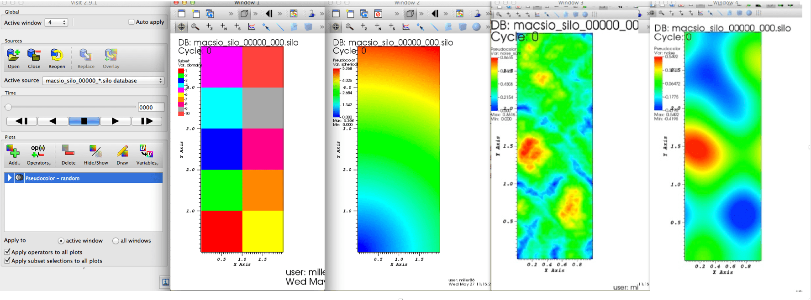
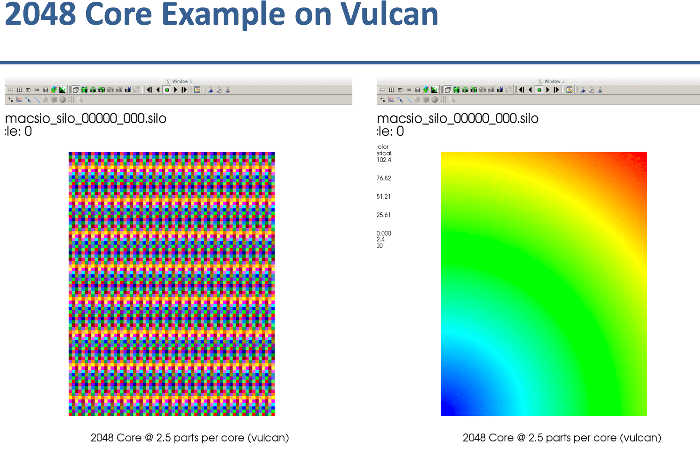

Using MACSio_
-------------

MACSio_ is probably very different from many other I/O benchmarking tools you
may be familiar with. To orient yourself, it may be useful to read the first
sections of the original :download:`design document <macsio_design.pdf>`.

In particular, in *MACSio_ speak*, when we talk about I/O requests, request
sizes, frequencies, etc., we speak about them in terms of the operations
of a *real* application performing *dumps* of its *mesh* and *field* data.

By default, MACSio_'s command-line arguments are designed to maintain constant
per-task I/O workload as task count is varied. This means MACSio_, by default,
exhibits *weak scaling* behavior. This does not mean, however, that strong scaling
scenarios cannot also be handled. It means only that extra work is involved in
constructing command-line arguments to ensure a *strong scaling* goal is achieved
if that is desired.

.. only:: internals

   .. note:: Should enhance MACSio_ command-line to allow caller to indicate which
             modality of scaling/sizing is desired and then treat sizing argument(s)
             as either per-task or global.

MACSio_ has a large number of command-line arguments. In addition, each plugin may
define additional command-line arguments. Full documentation of all MACSio_'s 
command-line arguments and their meaning can be obtained with the command

.. code-block:: shell

   % ./macsio --help | more

Be ready for a lot of output!

Here, we will describe only some of the basic arguments necessary to do initial
testing that MACSio_ is installed correctly and to scale to large sizes.

All command-line arguments specified *after* the keyword argument ``--plugin_args``
are passed to the plugin and not interpreted by MACSio_'s main.

.. only:: internals

   .. note:: Should enhance --help to allow getting help on just one plugin's
             options.

   .. note:: Fix terminology here. We're using --interface to specify the name of the plugin
             and later --plugin_args. Maybe just stick with 'plugin'. A similar issue exists
             with 'rank' vs. 'task'.

   .. note:: We should create a glossary of terms

Summary of Key Command Line Arguments
^^^^^^^^^^^^^^^^^^^^^^^^^^^^^^^^^^^^^

MACSio_ has many command-line arguments and that number is only likely to grow with time.
We discuss here, only those the most relevant to initially getting started running MACSio_
tests.

MACSio_ is different from I/O benchmarking tools because it constructs and marshals data
as real data objects commonly used in scientific computing applications. All of its
command-line arguments are designed in these terms and one has to understand how those
choices effect I/O workload created by MACSio_.

In the descriptions below, default values for all command-line arguments are indicated
in square brackets.

.. _interface_clarg:

--interface : ``--interface %s [miftmpl]``
      Specify the name of the interface (e.g. plugin) to be tested. Use keyword
      `list` to print a list of all known interface names and then exit.
      Examples:

         * Get list of available plugins

         .. code-block:: shell

            % ./macsio --interface list
            List of available I/O-library plugins...
            "miftmpl", "hdf5", "silo", "typhonio"

         * Use the HDF5_ plugin for a given test

         .. code-block:: shell

            % ./macsio --interface hdf5

--parallel_file_mode : ``--parallel_file_mode %s %d [MIF 4]``
    Specify the parallel file mode. There are several choices.  Not all parallel
    modes are supported by all plugins. Use 'MIF' for Multiple Independent File (MIF_)
    mode and then also specify the number of files. Or, use 'MIFFPP' for MIF_
    mode and one file per task and where macsio uses known task count.
    Use 'MIFOPT' for MIF_ mode and let MACSio_ determine an *optimum* file count
    based on heuristics. Use 'SIF' for SIngle shared File mode. If you also give a
    file count for SIF mode, then MACSio_ will perform a sort of hybrid combination
    of MIF_ and SIF modes.  It will produce the specified number of files by grouping
    tasks in the the same way MIF_ does, but I/O within each group will be to a single,
    shared file using SIF mode and a subsetted communicator. When using SIF parallel
    mode, be sure you are running on a true parallel file system (e.g. GPFS or Lustre).

.. only:: internals

   .. note:: A plugin should specify which modes it supports.

--part_type : ``--part_type %s [rectilinear]``
    Options are 'uniform', 'rectilinear', 'curvilinear', 'unstructured' and 'arbitrary'.
    Generally, this option impacts only the I/O worload associated with the mesh object
    itself and not any variables defined on the mesh. However, not all I/O libraries
    (or their associated MACSio_ plugins) support all mesh types and when making
    comparisons it is important to have the option of specifying various mesh types.

--part-dim : ``--part_dim %d [2]``
    Spatial dimension of mesh parts; 1, 2, or 3. In most cases, 2 is a good choice
    because it makes downstream visualization of MACSio_ data easier and more natural.
    While MACSio_ is designed such that we would not ordinarily expect I/O workload
    to be substantially different for different spatial dimensions, this isn't always
    known to be true for all possible plugins ahead of time.

--part_size : ``--part_size %d [80000]``
    Per-task mesh part size. This becomes the *nominal* I/O request size used by each
    task when marshaling data. A following ``B`` | ``K`` | ``M`` | ``G`` character
    indicates 'B'ytes, 'K'ilo-, 'M'ega- or 'G'iga- bytes representing powers of either
    1000 or 1024 depending on the selected units prefix system. With no size modifier
    character, 'B'ytes is assumed.  Mesh and variable data is then sized by MACSio_ to
    hit this target byte count in I/O requests.  However, due to constraints involved in
    creating valid mesh topology and variable data with realistic variation in features
    (e.g.  zone- and node-centering), this target byte count is hit exactly for only the
    most commonly used objects and approximately for other objects.

--avg_num_parts : ``--avg_num_parts %f [1]``
    The average number of mesh parts per task.
    Non-integral values are acceptable. For example, a value that is half-way
    between two integers, K and K+1, means that half the task have K mesh
    parts and half have K+1 mesh parts, a typical scanrio for multi-physics
    applications. As another example, a value of 2.75 here would mean that 75%
    of the tasks get 3 parts and 25% of the tasks get 2 parts. Note that the total
    number of parts is this number multiplied by the task count. If the result of
    that product is non-integral, it will be rounded and a warning message will be
    generated.

--vars_per_part : ``--vars_per_part %d [20]``
    Number of mesh variables on each part. This controls the *number* of I/O requests
    each task makes to complete a given dump. Typical physics simulations run
    with anywhere from just a few effectively to several hundred mesh variables.
    Note that the choice in mesh part_type sets a lower bound on the effective number
    of mesh variables marshaled by MACSio_ due to the storage involved for the
    mesh coordinate and topology data alone. For example, for a uniform mesh this
    lower bound is effectively zero because there is no coordinate or topology data
    for the mesh itself.  This is also almost true for rectilinear meshes.
    For curvilinear mesh the lower bound is the number of spatial dimensions and for
    unstructured mesh it is the number of spatial dimensions plus 2^number of
    topological dimensions.

.. note:: uniform vs. rectilinear not fully defined here.

--num_dumps : ``--num_dumps %d [10]``
    Total number of dumps to marshal

--dataset_growth : ``--dataset_growth %f [1]``
    A multiplier factor by which the volume of data will grow
    between dump iterations If no value is given or the value is <1.0 no
    dataset changes will take place.

.. only:: internals

   .. note:: This should be changed to generalized to include not just enlargement
             but shrinkage and perhaps even some randomness in the direction and
             amount of change in size from dump to dump.

--meta_type : ``--meta_type %s [tabular]``
    Specify the type of metadata objects to include in
    each main dump.  Options are 'tabular' or 'amorphous'. For tabular type
    data, MACSio will generate a random set of tables of somewhat random
    structure and content. For amorphous, MACSio will generate a random
    hierarchy of random type and sized objects.

--meta_size : ``--meta_size %d %d [10000 50000]``
    Specify the size of the metadata objects on
    each task and separately, the root (or master) task (MPI rank
    0). The size is specified in terms of the total number of bytes in the
    metadata objects MACSio_ creates. For example, a type of tabular and a size
    of 10K bytes might result in 3 random tables; one table with 250 unnamed
    records where each record is an array of 3 doubles for a total of 6000
    bytes, another table of 200 records where each record is a named integer
    value where each name is length 8 chars for a total of 2400 bytes and a
    3rd table of 40 unnamed records where each record is a 40 byte struct
    comprised of ints and doubles for a total of 1600 bytes.

.. only:: internals

   .. note:: These should be changed to allow for multiple random tables and/or
             random key/val hierarchies.

--compute_work_intensity : ``--compute_work_intensity %d [0]``
    Add some compute workload (e.g. give the tasks something to do)
    between I/O dumps. There are three levels of 'compute' that can be performed
    as follows:

          * Level 1: Perform a basic sleep operation (this is the default)
          * Level 2: Perform some simple FLOPS with randomly accessed data
          * Level 3: Solves the 2D Poisson equation via the Jacobi iterative method

    This input is intended to be used in conjunection with --compute_time
    which will roughly control how much time is spent doing work between dumps.

--time_randomize : ``--time_randomize [0]``
    Make :ref:`randomization <macsio_data_randomization>` in MACSio_ vary from
    dump to dump within a given run and from run to run by using PRNGs seeded by time.

--plugin-args : ``--plugin_args``
    All arguments after this sentinel are passed to the I/O plugin plugin.

MACSio_ Command Line Examples
^^^^^^^^^^^^^^^^^^^^^^^^^^^^^

* To run with Multiple Independent File (MIF_) mode to on 93 tasks to 8 HDF5_ files...

  .. code-block:: shell

     mpirun -np 93 macsio --interface hdf5 --parallel_file_mode MIF 8

* Same as above to but a Single Shared File (SIF) mode to 1 HDF5_ file (note: this
  is possible with the same plugin because the HDF5_ plugin in MACSio_ has been
  designed to support both the MIF_ and SIF parallel I/O modes.

  .. code-block:: shell

     mpirun -np 93 macsio --interface hdf5 --parallel_file_mode SIF 1

* Default per-task request size is 80,000 bytes (10K doubles). To use a different
  request size, use --part_size. For example, to run on 128 tasks, 8 files in MIF_
  mode where I/O request size is 10 megabytes, use

  .. code-block:: shell

     mpirun -np 128 macsio --interface hdf5 --parallel_file_mode MIF_ 8 --part_size 10M

  Here, the ``M`` after the ``10`` means either decimal Megabytes (Mb) or binary
  Mibibytes (Mi) depending on setting for ``--units_prefix_system``. Default is binary.

* To use H5Z-ZFP compression plugin (**note:** we're talking about an HDF5_ *plugin* here),
  be sure to have the plugin compiled and available
  with the same compiler and version of HDF5_ you are using with MACSio_. Here, we 
  demonstrate a MACSio_ command line that runs on 4 tasks, does MIF_ parallel I/O mode
  to 2 files, on a two dimensional, rectilinear mesh with an average number of parts per
  task of 2.5 and a nominal I/O request size of 40,000 bytes. The args after ``--plugin-args``
  are to specify ZFP compression parameters to the HDF5_ plugin. In this case, we use
  H5Z-ZFP compression plugin in *rate* mode with a bit-rate of 4.

  .. code-block:: shell

     env HDF5_PLUGIN_PATH=<path-to-plugin-dir> mpirun -np 4 ./macsio --interface hdf5 --parallel_file_mode MIF 2 --avg_num_parts 2.5 --part_size 40000 --part_dim 2 --part_type rectilinear --num_dumps 2 --plugin_args --compression zfp rate=4

  where ``path-to-plugin-dir`` is the path to the directory containing ``libh5zzfp.{a,so,dylib}``

.. only:: internals

   .. note:: We should support any arbitrary HDF5_ plugin here by allowing for id=%d and cdvals="%d %d ..."

Weak Scaling Study Command-Line Example
^^^^^^^^^^^^^^^^^^^^^^^^^^^^^^^^^^^^^^^

Suppose you want to perform a weak scaling study with MACSio_ in MIF_ parllel I/O mode
and where per-task I/O requests are nominally 100 kilobytes and each task has 8
mesh parts.

All MACSio_ command line arguments remain the same. The only difference is the task
count you execute MACSio_ with.

.. code-block:: shell

   for n in 32 64 128 256 512 1024 2048 4096
   do
       mpirun -np $n macsio --interface hdf5 --avg_num_parts 8 --part_size 100K --parallel_file_mode MIF 32
   done

Now, the above example *started* with a task count of 32 and 32 files in MIF_ mode and
kept the file count constant. It is concievable that if you continued this study to
larger and larger scales, you may also want the MIF_ file count to vary somewhat as well.
Here is an example of doing that.

Example 
"""""""

.. include:: ../macsio/weak_scaling.sh
   :code: shell

Which when run, results in the following sequence of MACSio_ command-lines.

.. code-block:: shell

   mpirun -np 32 macsio --interface hdf5 --avg_num_parts 8 --part_size 100K --parallel_file_mode MIF 32
   mpirun -np 64 macsio --interface hdf5 --avg_num_parts 8 --part_size 100K --parallel_file_mode MIF 64
   mpirun -np 128 macsio --interface hdf5 --avg_num_parts 8 --part_size 100K --parallel_file_mode MIF 64
   mpirun -np 256 macsio --interface hdf5 --avg_num_parts 8 --part_size 100K --parallel_file_mode MIF 64
   mpirun -np 512 macsio --interface hdf5 --avg_num_parts 8 --part_size 100K --parallel_file_mode MIF 64
   mpirun -np 1024 macsio --interface hdf5 --avg_num_parts 8 --part_size 100K --parallel_file_mode MIF 64
   mpirun -np 2048 macsio --interface hdf5 --avg_num_parts 8 --part_size 100K --parallel_file_mode MIF 64
   mpirun -np 4096 macsio --interface hdf5 --avg_num_parts 8 --part_size 100K --parallel_file_mode MIF 64
   mpirun -np 8192 macsio --interface hdf5 --avg_num_parts 8 --part_size 100K --parallel_file_mode MIF 64
   mpirun -np 16384 macsio --interface hdf5 --avg_num_parts 8 --part_size 100K --parallel_file_mode MIF 128
   mpirun -np 32768 macsio --interface hdf5 --avg_num_parts 8 --part_size 100K --parallel_file_mode MIF 128
   mpirun -np 65536 macsio --interface hdf5 --avg_num_parts 8 --part_size 100K --parallel_file_mode MIF 128
   mpirun -np 131072 macsio --interface hdf5 --avg_num_parts 8 --part_size 100K --parallel_file_mode MIF 256
   mpirun -np 262144 macsio --interface hdf5 --avg_num_parts 8 --part_size 100K --parallel_file_mode MIF 256

Because the default mesh type is rectilinear (which involves very little in the way of I/O for the mesh itself),
the default number of mesh variables is 20, for a *typical* plugin running the MIF parallel I/O mode,
each task will emit 8*20 (there are 8 mesh parts per task), 100K writes for a given dump. The default number of
dumps is 10, so this will be repeated 10 times. For a ``--parallel_file_mode MIF 32`` run, each dump will produce
32 files for a total of 320 files produced for that *first* run. In the first run, because file count and
task count are 1:1, each file will contain just 8 mesh parts. For the last run, there are 256 files per dump
but 262144 tasks, each task having 8 mesh parts. So, each file would, in that case, contain 8192 mesh parts.

Now, because the HDF5 plugin also supports the SIF parallel I/O mode, we could run the same sequence of tests
in that mode by replacing ``MIF XX`` with ``SIF``.

Strong Scaling Study Command-Line Example
^^^^^^^^^^^^^^^^^^^^^^^^^^^^^^^^^^^^^^^^^

Suppose we wish to perform a *strong* scaling study. In this case, we need to settle upon the global
final mesh size and then construct MACSio_ command lines for each run such that the task count
together with the per-task command-line arguments results in the same (or approximately so) global
final mesh object in each run.

In the preceding *weak* scaling example, MACSio_ generated a *global* mesh of size in the range
[8*32*100K, 8*262144*100K]. Selecting a middle-of-the-range run of 8*8192*100K (6,710,886,400 bytes)
as a *nominal* *global* mesh size, we can then use a given task count to determine part size
and average part count to hit that target global size. We demonstrate this in the following code block...

.. include:: ../macsio/strong_scaling.sh
   :code: shell

When this shell code is run, it results in the following sequence of MACSio_ command-lines. Note that we cap
the total number of files at 1024. Depending on the particular system where this is run, this cap may be too low
or too high. The *best* number is the number of I/O *nodes* a given instance of MACSio_ can *see* when running.
Because this number typically varies with task count and where on the system the tasks are actually allocated,
this number is not always easily known or obtained.

.. code-block:: shell

   mpirun -np 32 ./macsio --interface hdf5 --avg_num_parts 2048 --part_size 102400 --parallel_file_mode MIF 32
   mpirun -np 64 ./macsio --interface hdf5 --avg_num_parts 1024 --part_size 102400 --parallel_file_mode MIF 64
   mpirun -np 128 ./macsio --interface hdf5 --avg_num_parts 512 --part_size 102400 --parallel_file_mode MIF 128
   mpirun -np 256 ./macsio --interface hdf5 --avg_num_parts 256 --part_size 102400 --parallel_file_mode MIF 256
   mpirun -np 512 ./macsio --interface hdf5 --avg_num_parts 128 --part_size 102400 --parallel_file_mode MIF 512
   mpirun -np 1024 ./macsio --interface hdf5 --avg_num_parts 64 --part_size 102400 --parallel_file_mode MIF 1024
   mpirun -np 2048 ./macsio --interface hdf5 --avg_num_parts 32 --part_size 102400 --parallel_file_mode MIF 1024
   mpirun -np 4096 ./macsio --interface hdf5 --avg_num_parts 16 --part_size 102400 --parallel_file_mode MIF 1024
   mpirun -np 8192 ./macsio --interface hdf5 --avg_num_parts 8 --part_size 102400 --parallel_file_mode MIF 1024
   mpirun -np 16384 ./macsio --interface hdf5 --avg_num_parts 4 --part_size 102400 --parallel_file_mode MIF 1024
   mpirun -np 32768 ./macsio --interface hdf5 --avg_num_parts 2 --part_size 102400 --parallel_file_mode MIF 1024
   mpirun -np 65536 ./macsio --interface hdf5 --avg_num_parts 1 --part_size 102400 --parallel_file_mode MIF 1024
   mpirun -np 131072 ./macsio --interface hdf5 --avg_num_parts 1 --part_size 51200 --parallel_file_mode MIF 1024
   mpirun -np 262144 ./macsio --interface hdf5 --avg_num_parts 1 --part_size 25600 --parallel_file_mode MIF 1024

To perform a strong scaling study in SIF parallel I/O mode, just replace the trailing
``MIF $nf`` in the above MACSio_ command line above with ``SIF``.

This strong scaling scenario maintains constant part size (up to the last three iterations) and just
varies the part count to hit the target global size. Instead, we may want to do a strong scaling
scenario where we maintain just a single part per task and vary that single part's size to hit the
target global size. This is demonstrated with following code...

.. include:: ../macsio/strong_scaling_single_part.sh
   :code: shell

which prodcues the following sequence of MACSio_ command-lines...

.. code-block:: shell

   mpirun -np 32 ./macsio --interface hdf5 --avg_num_parts 1 --part_size 209715200 --parallel_file_mode MIF 32
   mpirun -np 64 ./macsio --interface hdf5 --avg_num_parts 1 --part_size 104857600 --parallel_file_mode MIF 64
   mpirun -np 128 ./macsio --interface hdf5 --avg_num_parts 1 --part_size 52428800 --parallel_file_mode MIF 128
   mpirun -np 256 ./macsio --interface hdf5 --avg_num_parts 1 --part_size 26214400 --parallel_file_mode MIF 256
   mpirun -np 512 ./macsio --interface hdf5 --avg_num_parts 1 --part_size 13107200 --parallel_file_mode MIF 512
   mpirun -np 1024 ./macsio --interface hdf5 --avg_num_parts 1 --part_size 6553600 --parallel_file_mode MIF 1024
   mpirun -np 2048 ./macsio --interface hdf5 --avg_num_parts 1 --part_size 3276800 --parallel_file_mode MIF 1024
   mpirun -np 4096 ./macsio --interface hdf5 --avg_num_parts 1 --part_size 1638400 --parallel_file_mode MIF 1024
   mpirun -np 8192 ./macsio --interface hdf5 --avg_num_parts 1 --part_size 819200 --parallel_file_mode MIF 1024
   mpirun -np 16384 ./macsio --interface hdf5 --avg_num_parts 1 --part_size 409600 --parallel_file_mode MIF 1024
   mpirun -np 32768 ./macsio --interface hdf5 --avg_num_parts 1 --part_size 204800 --parallel_file_mode MIF 1024
   mpirun -np 65536 ./macsio --interface hdf5 --avg_num_parts 1 --part_size 102400 --parallel_file_mode MIF 1024
   mpirun -np 131072 ./macsio --interface hdf5 --avg_num_parts 1 --part_size 51200 --parallel_file_mode MIF 1024
   mpirun -np 262144 ./macsio --interface hdf5 --avg_num_parts 1 --part_size 25600 --parallel_file_mode MIF 1024

The difference in these two strong scaling scenarious is that the first one will suffer from per-part
overheads. Each task will have per-part memory overheads and per-part I/O request overheads which the
second scenario does not suffer.

Assessing Performance Achieved by MACSio
^^^^^^^^^^^^^^^^^^^^^^^^^^^^^^^^^^^^^^^^

On the one hand, MACSio_ tries to boil all the performance data down to a single, scalar
metric; the average time to complete a *dump* or the average *bandwidth* for completing
a dump. This information is captured in task 0's section (header) MACSio_'s main log file,
``macsio-log.log``.

.. only:: internals

   .. note:: Change log file to use *task* instead of *processor*.

An example is shown below for 10 dumps from a 4 task run.

.. include:: ../macsio/macsio-log-example.log
   :code: shell

The key line in the file, for task 0, is the total bytes divided by the time between
the last task to finish and the first task to start which looks similar to the line
below...

.. code-block:: shell

   Info:"macsio_main.c":727:Total Bytes:  57.4580 Mi; Last finisher - First starter =   1.5012 secs; BW =  38.2758 Mi/sec:::

Detailed Performance Data
"""""""""""""""""""""""""

Detailed performance data is captured by MACSio_ as :ref:`timers <macsio_timing>` and then
dumped to strings (see :any:`MACSIO_TIMING_DumpTimersToStrings` for specific format of dumped
timer data strings) for output to a :ref:`log <macsio_logging>` file upon exit.

The performance data gathered by MACSio_ is wholly dependent on the degree to which
developers of MACSio_ or its plugins have instrumented MACSio_ with suitable timing
calls. If timing information provided is not sufficient, the solution is to submit
a PR with relevant timer calls added.

Each task maintains its own unique set of timers for its own activities. In addition,
MACSio_ will reduce all the task-specific timers just prior to completion. All timer data,
the task-specific timers together with the reduced timers, is then dumped to a MACSio_ log
file with the name ``macsio-timings.log``. That single file captures all of the performance
data for a given run of MACSio. 

.. only:: internals

   .. note:: We should provide tool to convert log file contents to hbase or some other
             suitable big data format for archival storage and analysis.

   .. note:: In order to capture per-dump timing data, we would need a log file that is
             a) created at beginning of run so that each dump's data can be added and b)
             has enough lines reserved to capture all. How do we do that? If timers had
             "level-of-detail" kind of knob, then we could write per-dump timers at
             coarser levels of detail to minimize usage of reserved space in log.

             Another option is to hold timing data in memory and then message pass each
             task's data to a single file writer task that outputs it to disk at termination.

Validating Data MACSio Produces
^^^^^^^^^^^^^^^^^^^^^^^^^^^^^^^

Most MACSio_ plugins produce *valid* scientific computing data which can be processed by
other common *workflow* tools and, in particular, visualization tools such as
VisIt_, `ParaView <https://www.paraview.org>`_ or
`Ensight <https://www.ansys.com/products/platform/ansys-ensight>`_.

The images here demonstrate MACSio_, 2D data written with the Silo_ plugin

   VisIt_ displaying MACSio_ produced data on 4 tasks and 2.5 parts per task with the Silo_ plugin.
   From left to right, the visualizations display the parallel decomposition of the mesh into
   blocks, a smoothly varying, node-centered variable on the mesh, a high noise node-centered variable
   and a low-noise node-centered variable.

   VisIt_ displaying MACSio_ produced data on 2048 tasks and 2.5 parts per task with the Silo_ plugin
   The left image shows the parallel decomposition of the mesh. The right image shows a smoothly
   varying node-centered variable. In this example, there were 2048 tasks and 5120 mesh parts.
